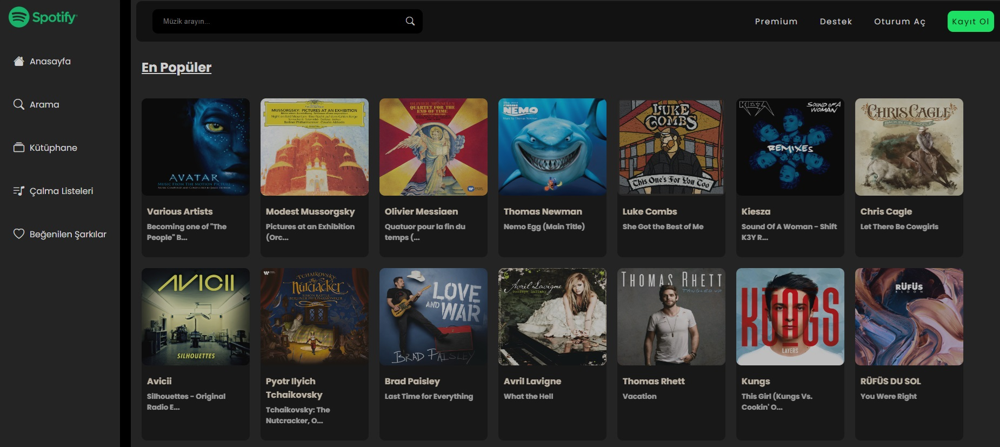

# Spotify Projesi:
Türkiye'deki popüler müzikleri ekrana yansıtmak için Shazam API'sini kullandık.

Kullanıcı tarafından girilen müzik bilgilerini API'den alarak kullanıcıya sunduk.

# Projede Kullanılan Teknolojiler:

-HTML
-SCSS
-JavaScript
-Responsive tasarım

# Screenshots

# GIF

